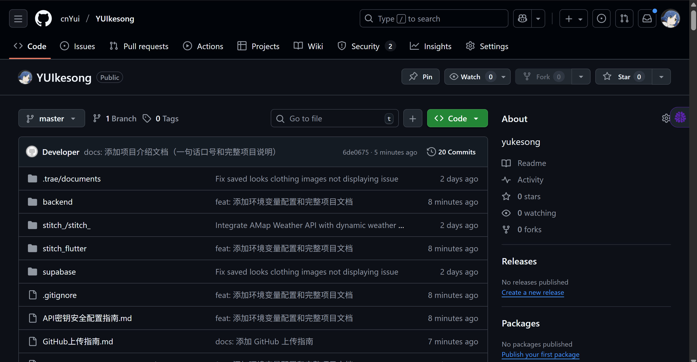

# 视频文件上传说明

## ⚠️ 问题说明

视频文件 `屏幕录制 2025-11-15 192635.mp4` 大小为 **489.58 MB**，超过了 GitHub 的单个文件大小限制（100 MB）。

## ✅ 已上传的文件

- ✅ `image.png` (0.43 MB) - 已成功上传到 GitHub

## 📹 视频文件处理方案

### 方案一：使用 Git LFS（推荐用于大文件）

Git LFS (Large File Storage) 是 GitHub 提供的大文件存储解决方案。

#### 安装 Git LFS

```bash
# Windows (使用 Chocolatey)
choco install git-lfs

# 或下载安装包
# https://git-lfs.github.com/
```

#### 配置 Git LFS

```bash
# 初始化 Git LFS
git lfs install

# 跟踪视频文件
git lfs track "*.mp4"

# 添加 .gitattributes 文件
git add .gitattributes

# 添加视频文件
git add "屏幕录制 2025-11-15 192635.mp4"

# 提交
git commit -m "docs: 添加项目演示视频 (使用 Git LFS)"

# 推送
git push origin main:master
```

### 方案二：压缩视频文件

使用视频压缩工具减小文件大小：

#### 推荐工具：
- **HandBrake** (免费，跨平台)
- **FFmpeg** (命令行工具)
- **在线压缩工具**

#### 使用 FFmpeg 压缩示例：

```bash
# 安装 FFmpeg 后执行
ffmpeg -i "屏幕录制 2025-11-15 192635.mp4" -vcodec libx264 -crf 28 -preset slow -acodec aac -b:a 128k "屏幕录制_压缩版.mp4"
```

### 方案三：上传到视频平台（推荐用于演示）

将视频上传到视频分享平台，然后在 README 中嵌入链接：

#### 推荐平台：
- **YouTube** - 适合公开演示
- **Bilibili** - 适合中文用户
- **Vimeo** - 专业视频平台
- **GitHub Releases** - 可以作为 Release 附件上传

#### 在 README 中添加视频链接：

```markdown
## 🎥 项目演示

[](https://www.youtube.com/watch?v=VIDEO_ID)

或使用 Bilibili：

[](https://www.bilibili.com/video/BVxxxxx)
```

### 方案四：使用 GitHub Releases

GitHub Releases 支持上传较大的文件（最大 2 GB）：

1. 在 GitHub 仓库页面点击 **Releases**
2. 点击 **Create a new release**
3. 填写版本号和描述
4. 上传视频文件作为附件
5. 在 README 中添加下载链接

## 🎯 推荐方案

对于项目演示视频，我推荐：

1. **短期方案**：上传到 Bilibili 或 YouTube，在 README 中嵌入链接
2. **长期方案**：使用 Git LFS 或 GitHub Releases

## 📝 当前状态

- ✅ 图片文件已上传
- ⚠️ 视频文件需要选择上述方案之一处理

## 🔗 相关资源

- [Git LFS 文档](https://git-lfs.github.com/)
- [GitHub 文件大小限制](https://docs.github.com/en/repositories/working-with-files/managing-large-files/about-large-files-on-github)
- [HandBrake 下载](https://handbrake.fr/)
- [FFmpeg 下载](https://ffmpeg.org/download.html)

